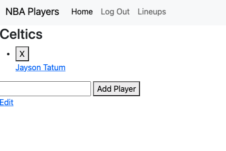

# NBA Player Lineups

An app that allows the user to create many lineups/teams that contain multible nba players within them.

## App Link

https://nbaplayertracker.fly.dev

## Screenshots

## Technologies Used

- Node.js, Express, Mongoose, MongoDB, Javascript, HTML, CSS, Fly.io
- balldontlie API 

## Getting Started

- Log in using Google
- Click "Add a new lineup" to create a new lineup resource
- Click the X next to the lineup name or player name to delete them
- Seaech a players name in the search bar and select "Add Player" to add a player to your lineup
- Click Edit to edit your lineup's name

## Ice Box

- Incorporate player pictures/stats into the app

- Be able to add a specific player and their details to a lineup by adding search functionality

- Paginate results so that we can see all of the players in the index

## Trello Link

https://trello.com/b/TxJvIG84/nba-player-tracker